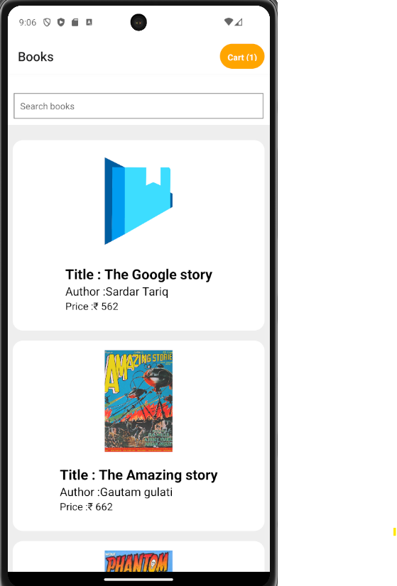
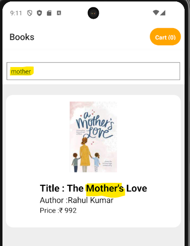
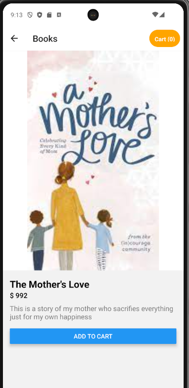
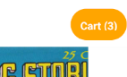
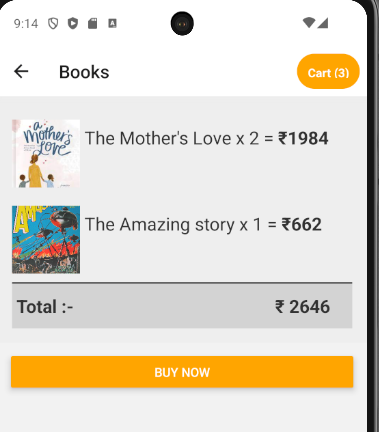
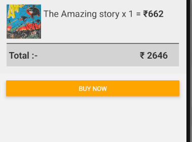
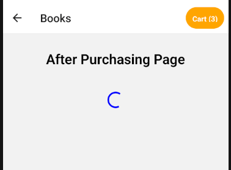
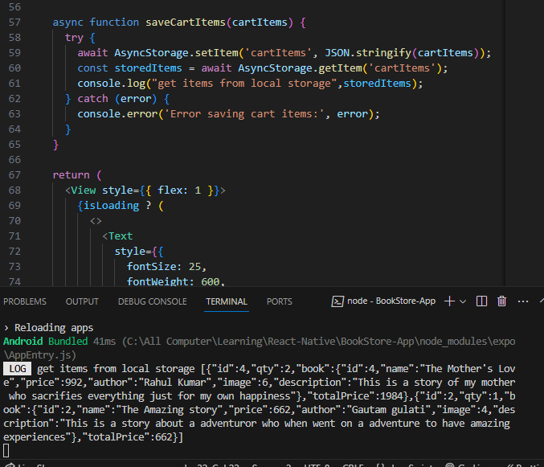
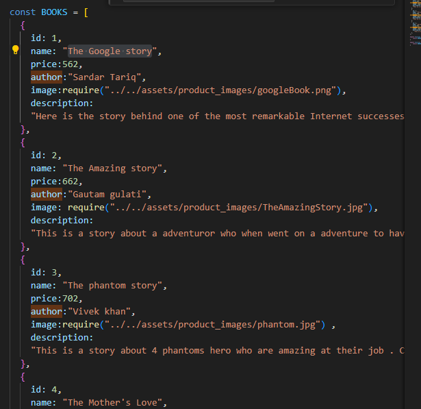

# BookStore-App

Clone the app on local >> Npm install in terminal >> Open android emulator .

Or see the expo snack

1. A simple Bookstore Mobile Application app Using React-Native . 

    Home Page -
        * User can see basic details of a books available
        

2. Book List Page 
    Display a list of books with their title, author, price, and thumbnail.
    Implement a search feature to filter books based on title

    

3. Book Detail Page:
    Show detailed information about the book when a user selects a book from the list.
    Include book title, author, description, price, and a larger image.

    

4. Shopping Cart:
    Allow users to add books to a shopping cart.
    Display the total price of the books in the cart.

    
    .
    

5. Order Placement:
    A simple order placement screen with a summary of the selected books and the total price.
    A "Place Order" button to simulate the order process (no real transaction required).

    
    After clicking on the buy now button
    

6. Local Storage:
    Use local storage to save the state of the shopping cart.

    

7. Technical Requirements:
    use react-native and useContext hook for state management
8. Navigation - use the react-navigation/native for navigation
9. Data Handling: src>>service>>BookService
    
 